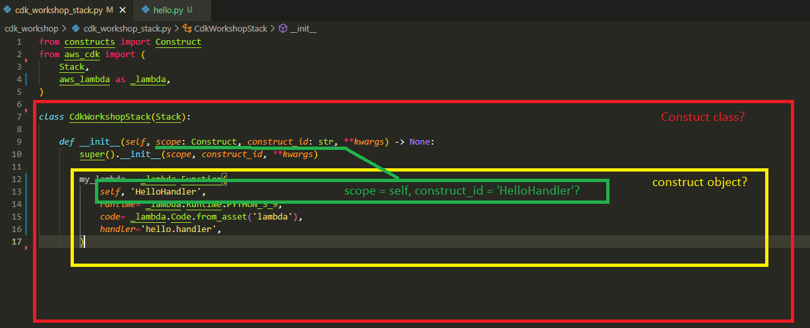

## Constructs are the basic building block of CDK apps. They represent abstract “cloud components” which can be composed together into higher level abstractions via scopes. Scopes can include constructs, which in turn can include other constructs, etc.

low-level (closer to machine language?)  
higher level (frameworks etc? premade stuff that makes your life easier)  
lowcode (GUI coding? why is this called low?!)
  
Scope in this context is similar to NameSpaces in container context?  
  
  
  
What is the logic behind 1 or more Stacks? (How do you decide when to use 1 and when to use multiple?)  
  
## Late-bound values
The function_name and table_name properties are values that only resolve when we deploy our stack (notice that we haven’t configured these physical names when we defined the table/function, only logical IDs). This means that if you print their values during synthesis, you will get a “TOKEN”, which is how the CDK represents these late-bound values. *You should treat tokens as opaque strings. This means you can concatenate them together for example, but don’t be tempted to parse them in your code.*

## Look up what Downstream means in CDK context